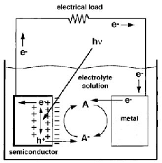
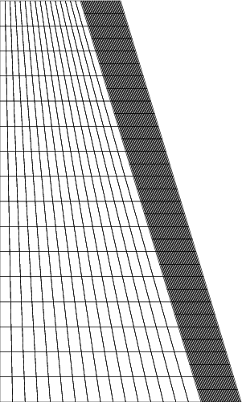
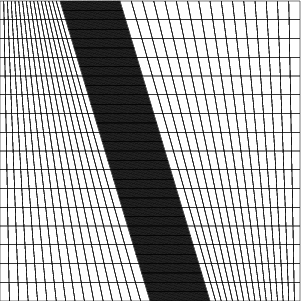

# PhotoElectrochemical Cell Simulator
## Introduction

### Photoelectrochemical Solar Cells

Large-scale utilization of photovoltaic (PV) devices, or solar cells, has been hampered 
for years due to high costs and lack of energy storage mechanisms.  <a href="https://en.wikipedia.org/wiki/Photoelectrochemical_cell">Photoelectrochemical solar cells</a>  (PECs), are an attractive alternative to conventional solid state PV devices.  PECs such as those depicted below are able to directly convert solar energy into hydrogen fuel.  The hydrogen fuel can then be used at a later time to generate electricity. The typical setup of a PEC is shown below

A PEC consists of four main components: the solid semiconductor electrode, the liquid electrolyte component, the semiconductor-electrolyte interface and the counter (metal or semiconductor) electrode.  When sunlight shines on the semiconductor component, photons are absorbed and generate electron-hole pairs. These electrons and holes are separated by a built-in electric field within the semiconductor. The separation of the electrons and holes leads to an electrical current in the cell and the accumulation of charges at the semiconductor-electrolyte interface.  At the interface, the photo-generated electrons or holes induce a chemical reaction at the semiconductor electrode. A similar chemical reaction also occurs at the counter electrode. These chemical reactions create or eliminate reductant-oxidant (redox) species in the electrolyte leading to the generation of hydrogen fuel.  

Research on PECs has traditionally focused on planar cell designs, but recently there has been interest in cell designs that use thin nanostructured wires such as those depicted below.

In a planar device such, photo-generated electrons and holes are collected in directions parallel to photon absorption. In order for PECs' to achieve sufficient energy conversion efficiencies to be commercially viable the electron/hole diffusion length (the average distance an electron/hole can be travel without being eliminated) must be larger than the absorption length (the average distance a photon will penetrate the semiconductor crystal before generating an electron-hole pair). This constraint necessitates the use of expensive, high quality crystals that either have large diffusion lengths or small absorption lengths. In PECs that use a nanowire design the electron/hole collection and photon absorption directions are  decoupled, thereby alleviating the need for high quality crystals to attain sufficient energy  conversion efficiencies.  Scientists believe that the shape of these nanowires can effect  the energy conversion efficiencies (see <a href="http://pubs.rsc.org/en/content/articlelanding/2012/ee/c1ee02518j#!divAbstract">here</a> for more information). This software therefore allows nanowires which are cylindrical or conic, like those seen below:

### Software Overview

This software is designed to simulate the dynamics of the reactive interface between a semiconductor and electrolyte in a 2D. The nanowire solar cells is then considered to be axially symmetric in order to reduce the 3D nanowire to a 2D domain. The interface between the semiconductor and electrolyte make up a "half cell" of a  <a href="https://en.wikipedia.org/wiki/Photoelectrochemical_cell">photoelectrochemical cell</a>. The main challenges in constructing numerical algorithms that produces reliable simulations of PECs are due to the highly nonlinear nature of the system and the different time scales of the semicondcutor and electrolye charge carrier.  Furthermore, regions of stiffness caused by boundary layer formation where sharp transitions in densities and electric potential occur near the interface (as shown below) and pose severe constraints on the choice of discretization strategy in order to maintain numerical stability.

This code will automatically run in parallel using the  <a href="https://www.threadingbuildingblocks.org/">Thread Building Blocks</a> for multithreading.

The resulting output files from simulations are in <a href="http://www.vtk.org/">VTK</a> format and can viewed using <a href="http://www.paraview.org/">Paraview</a>.  An example of such results are shown below,

## Documentation
For **much more** background on the model and algorithms as well as code itself please see the  <a href="http://mdh266.github.io/PECS/">documentation page</a>.

To build the documentation locally, you need <a href="http://www.stack.nl/~dimitri/doxygen/">doxygen</a>.  Once doxygen has been installed, cd into the <code>Documentation/</code> directory and run,

	doxygen dox

This will write the documentation locally in a folder <code>html</code> which should have been created in the main directory.  Open the file <code>index.html</code> within the <code>html</code> folder in your browser to access the documentation.

## Requirements

1. <a href="dealii.org">deal.ii</a> library version 8.3.0 or higher.
2. <a href="https://cmake.org/">CMake</a> version 2.8 or higher. 
2. <a href="http://www.paraview.org/">Paraview</a> for visualization.

## Using Software

First obtain and install a copy of the deal.ii library version 8.3.0 or higher. 
After downloading and installing the deal.II library. cd into the <code>PECS</code> directory.

To generate a make file to compile the source code type the following command into the terminal:

	cmake . -DDEAL_II_DIR="path to deal.II library"	

On a mac, if you downloaded the binaries of deal.ii library instead run the command:

	cmake .

Once the CMake build is completed you can run the command:

	make release	

to compile the code.

To run the code use the command:

	./main	

Material and design choices can be chosen by the user through the input file,

	input_file.prm	

**NOTE: Upon changing parameter values in the input file the code does not need to be recompiled.**

## Input Parameter File

Material and design choices can be chosen by the user through the input file:
<code>input_file.prm</code>.

Most of the parameters in <code>input_file.prm</code> will be self explanatory after reading the documentation and from the comments in the file. However, for clarity we will explain some here.  There are two end times in <code>input_file.prm</code> in case in the initial simulation has not fully converged to steady state. Instead of restarting the simulation from the initial conditions and rerunning the simulation we can restart the simulation and use the end conditions as our new starting conditions; this is achieved by setting:

<code> set restart status     = true</code>

And setting the <code>end time 2</code> to the desired new end time.

A typical mesh for the semiconductor is seen below,

The height of the mesh is the height of the nanowire and is set by,

<code>  set mesh height    = ... </code>

The top width is fixed by setting the top radius of the nano wire,

<code>  set radius one     =  ... </code>

the bottom width is fixed by setting the bottom radius of the nano wire,

<code>  set radius two     =  ... </code>

Refining the mesh globally is achieved by,

<code> set global refinements = ... </code>

Refining the mesh locally is achieved by,

<code> set local refinements  = ... </code>

Local refinement only occurs within a specified distance of the interface (on the right) and is that distance is set by,

<code> set boundary layer = ... </code>

The whole simulation mesh is seen below, 

The details of this mesh (refinements, height, radii, boundary layer) are controlled as described above. 
The width of the entire domain is set by,

<code>  set mesh length    = ... </code>

Both radii **MUST** be smaller than the mesh width. See Grid_Maker::Grid for more information.  Finally, the left and the right boundaries of the the entire domain will have Dirchlet boundary conditions (explained in documentation), while the top and bottom of the domain will have Neumann conditions (explained in documentation) by,

<code>  set insulated    = true </code>

otherwise the top and bottom of the domain will have Dirichlet conditions.  Finally, the
initial conditions are set in the source code file:

<code> InitialConditions.cpp </code>

and must be set before compilation.

## Trouble Shooting

If your simulation seems to be losing stability, there are two options:

1.) Choose a smaller time step, in 

<code>  set time step size     = ... </code>

2.) Refining the mesh especially near the interface.
